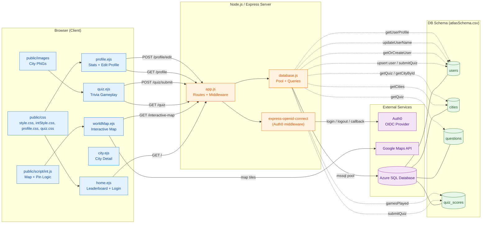

# Atlas Arena — Component Diagram

## Legend

- **Client (blue):** EJS views and static assets served from `public/`.
- **Server (orange):** Express app, Auth0 middleware, and the MSSQL data layer.
- **External (purple):** Auth0, Google Maps, Azure SQL.
- **Schema (green):** Tables defined in `public/atlasSchema.csv`.
